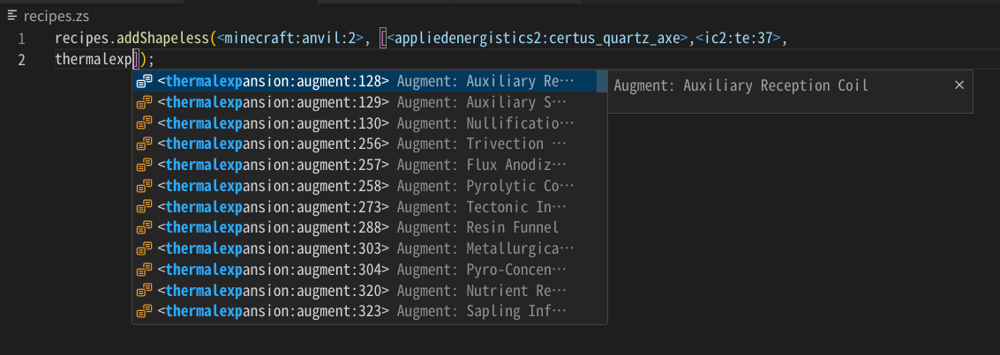
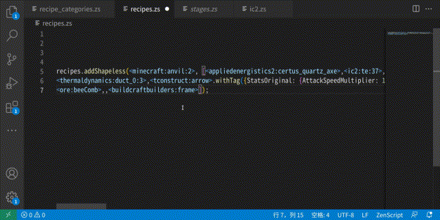
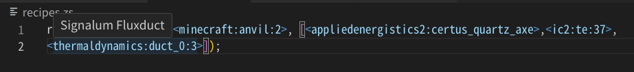
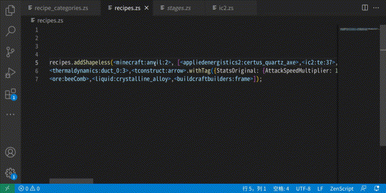
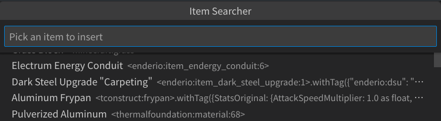

# ZenScript Bracket Completion

A vscode extension that handles autocompletion for ZenScript bracket handlers for your modded Minecraft instance.

## Features

* Generate data from YOUR Minecraft instance!

    [dumper_112.zs](dumper_112.zs)

* Autocompletion of BracketHandlers

    
    

* Show hover information for BracketHandlers

      
    

* Search and insert an item with its name

      

## Extension Settings

This extension contributes the following settings:
* `zsbc.completionSuggestAllItems`: Try to suggest ALL entries in every completion. Causes lag with a large list..
* `zsbc.completionSuggestWithStart`: Only suggest entries with matching starts in completion. Reduces lag.
* `zsbc.alwaysReload`: Prefer reloading from crafttweaker log every time. When set to false, only reload when cache is missing.
* `zsbc.path`: Point to your `crafttweaker.log`. Normally it's directly in your `.minecraft` folder.
* `zsbc.additional_path`: Path to your additional entries file. Only lines starts with a `<` will be added to completion.  
  Additionally, dumped line format is supported for providing information for them.
* `zsbc.ctapi`: CraftTweaker version to use. Currently does nothing.
* `zsbc.onlyCompleteBrackets`: Only triggers completion after brackethandler brackets.

## Setup
1. Install Crafttweaker on your Minecraft instance.
2. Copy one `dumper_xxx.zs` script (the one that matchs your Minecraft version) from this repository, to `.minecraft/scripts/` folder. Create the folder if it isn't there.
3. Launch Minecraft with CraftTweaker and the script loaded at least once.
4. Configure `zsbc.path` in VSCode workspace preferences, point it to your `crafttweaker.log`.

## Dumped File Format
- You can make your own dumper script or dumper mods, just make it output a dumped list between `[ZSBC DUMPER START]` and `[ZSBC DUMPER END]` following the format below:  
```
[ZSBC DUMPER START]
<entry1> = info1
<entry2> = info2
[COMMENT]
<entry3>.withTag("{}") = info3
<entry3>.withTag("{}") = info4
<entry5:2> = info5
...
[ZSBC DUMPER END]
```
- In this list, only lines with a ` = ` splitter will be considered an entry. (Notice that there are spaces in the splitter)  
  In every line, everything after the first splitter is considered information. You can't write comment in the same line of an entry.  
  Lines without a splitter are ignored, so them can be used as comment.  
- When multiple dumped lists are in one file, only the last one will be used.  

## Supported Languages
Zenscript (CraftTweaker)
TOML, json and Properties (Mod configs)
MCFunction (Vanilla)
Javascript (KubeJS)